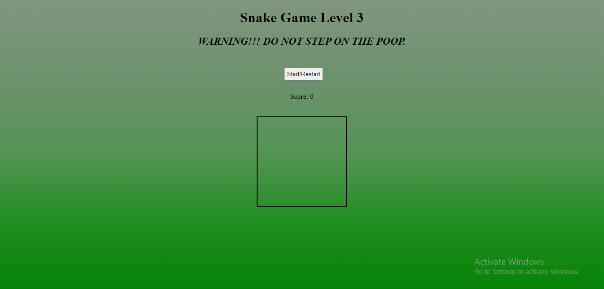

<h1 align="center">Grid Games</h1>
<h2>Introduction : </h2>
Grid Games is a collection of grid games written in HTML, CSS and JavaScript. 

 
 
It has six grid games:< 

<h2>1.Memory Game : </h2>

In this game, when you click over a card it flips, and you have to find two same cards in succession only then will you gain points.

oncea card flips you have to remember, what character does the card has, and next time when you find the same character flip the card with your memory.

And when you have matched all the cards you will receive a win message.

 
  

<h2>2.Connect Four : </h2>

Connect Four is a two player game 
In which each of the blue and red color denotes one player. 
Player one has red color goes first and marks a cell in the grid.

Then second players turn arises and they mark the cell in alternate order, 
whichever player first marks four cell either in a row, column or diagonally wins.

 
  

<h2>3.Space Invader : </h2>

In this three rows of invaders is arriving and the spaceship has to shoot them off.

If the invaders reaches you, you loose.

If you are able to shoot them before , then you win.

 
  

<h2>3.Snake Game : </h2>

The traditional snake game on level one:

 
The second level adds a twist to it, with snake pooping in the cell he eats the bait, 
snake does not grow and longer with eating baits, but if it steps on its poop, it will die.

 
In the third level, the snake grows and poops after eating the bait, 
and if snake steps on the poop, it dies.

 
  

<h2>3.Whack A Mole : </h2>

The game remains for 60 seconds, in which the mole randomly appears in the nine cells. 
You have to click on the cell in which the mole appears to acquire points. 
You have to gain as many points as you can.

 
  

<h2>3.Frogger : </h2>
In this game the frog is at the other side to his house, you have to help him reach his house.

You have to walk through the yellow crossing strips. If you step on the road you die.

Then, you have to help him cross the river. 
It can only pass river through the wooden logs, if he falls into water it dies.

Finally upon crossing both obstacles, you have to take him to his home. Which gains you victory.

 
 
This is the end.
 
<h1>Thank You.</h1>

